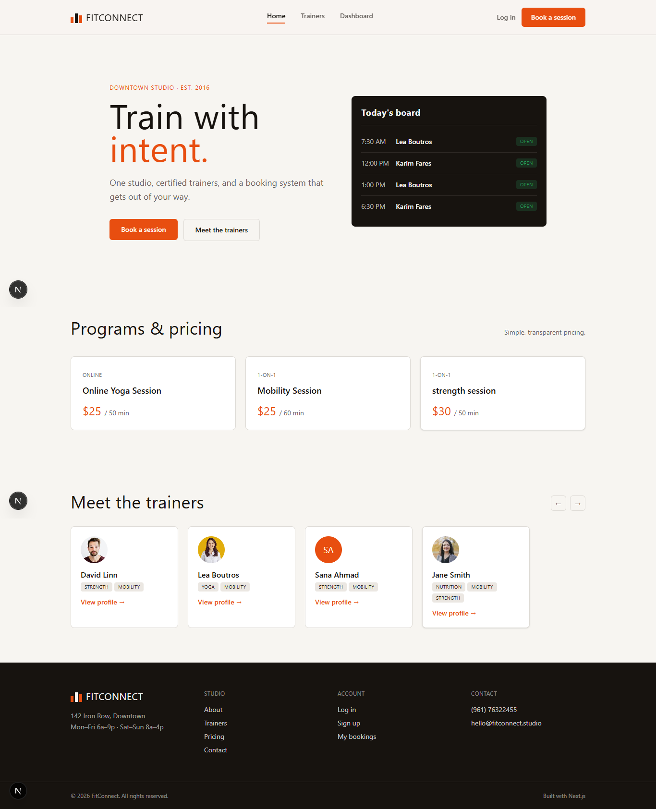
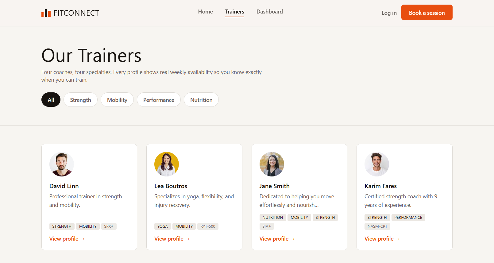
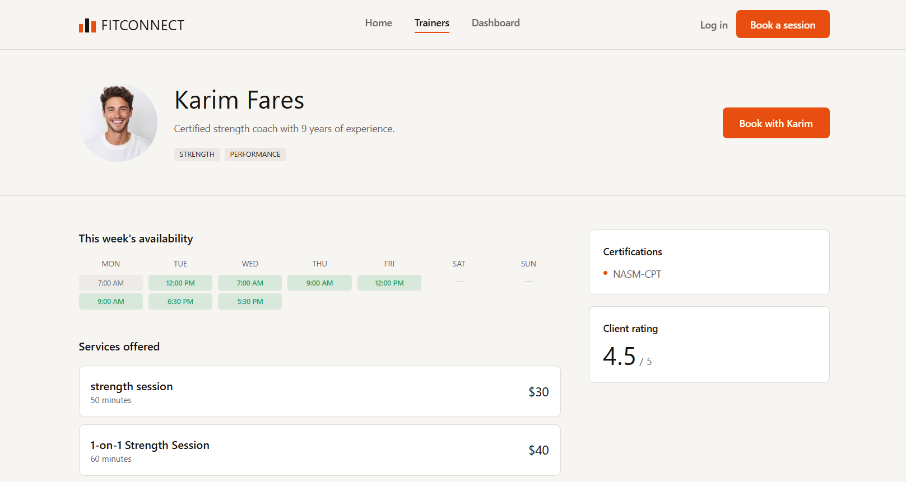
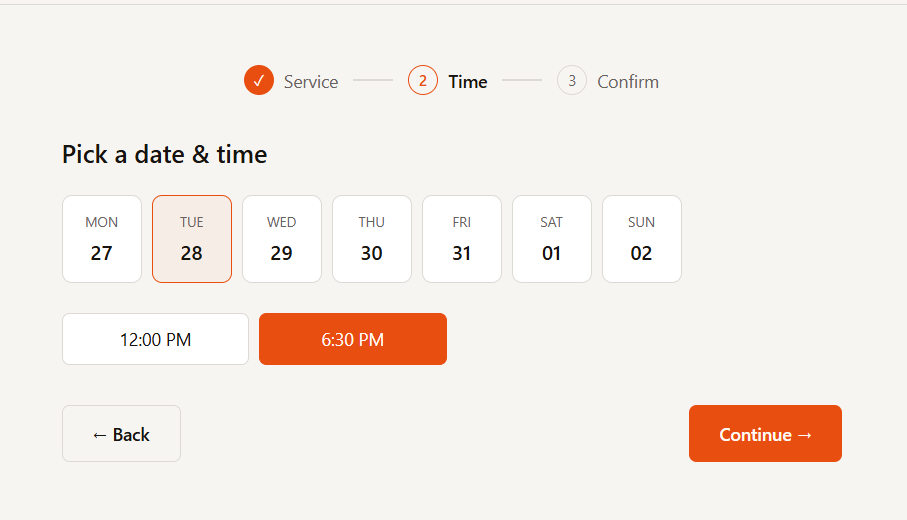
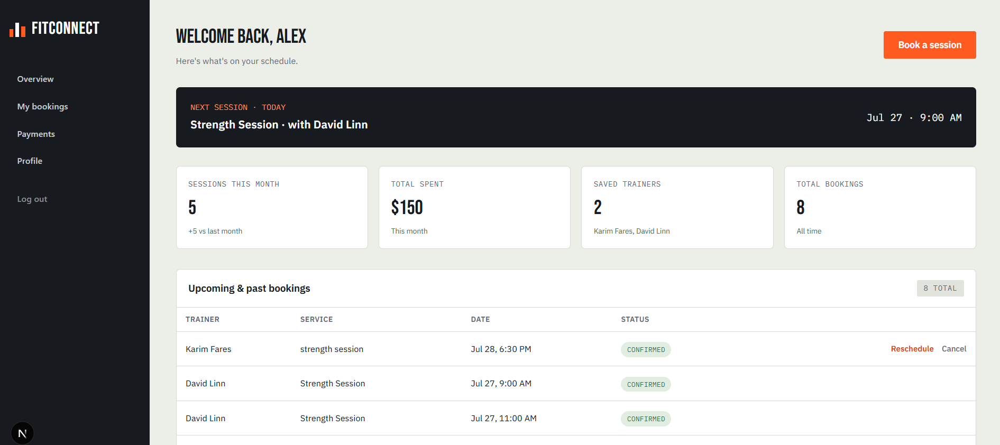
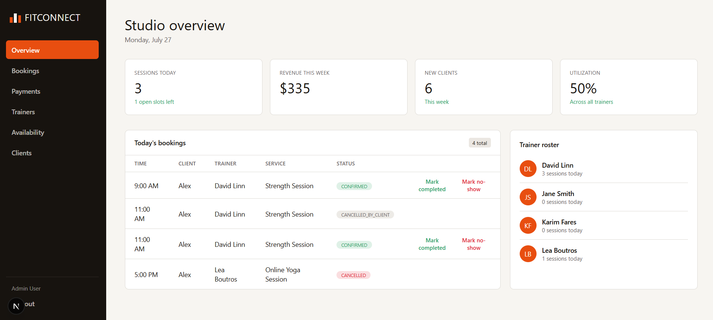

# FitConnect

A personal training studio booking platform. Clients browse trainers, book and pay for sessions, and manage their schedule from a dashboard. Trainers' availability is tracked in real time, and admins get a studio-wide overview.

Built with **Next.js (App Router)**, **Supabase** (Postgres, Auth, RLS), and **Resend** for transactional email.

---

## 📸 Screenshots

<!-- PLACEHOLDER: Add screenshots below. Suggested shots:
- Home page hero
- Trainers listing with specialty filters
- Trainer profile page
- Booking flow (service selection, time slot picker, payment)
- Client dashboard (overview, bookings, payments, profile)
- Admin dashboard (overview, trainers, bookings)
- Login / signup screen
-->

| Home | Trainers | Trainer Profile |
|---|---|---|
|  |  |  |

| Booking Flow | Client Dashboard | Admin Dashboard |
|---|---|---|
|  |  |  |

---

## ✨ Features

### For clients
- Browse trainers with specialty-based filtering (dynamic, derived from live trainer data)
- View trainer profiles: bio, certifications, rating, weekly availability, services offered
- Multi-step booking flow: select service → pick date/time → review & pay
- Card payment validation using the **Luhn algorithm**, with expiry and CVC checks
- Reschedule a booking **once**, or cancel it — with automatic refund eligibility based on a **24-hour cancellation policy**
- Client dashboard: upcoming sessions, monthly stats, full booking history, payment history
- Email notifications for booking confirmation, reschedule, and cancellation

### For admins
- Studio-wide overview: active trainers, total bookings, client count
- Role-based access — admins are routed to `/admin`, clients to `/dashboard`, automatically on login

### Platform
- Supabase Auth (email/password) with role-based routing (`client` / `admin`)
- Row Level Security on every table — users can only read/write their own data
- Past time slots are automatically disabled from booking and rescheduling
- Responsive design matching a custom design system (Bebas Neue / IBM Plex Sans & Mono)

---

## 🛠 Tech Stack

| Layer | Technology |
|---|---|
| Framework | Next.js (App Router, Server Actions, Server Components) |
| Language | TypeScript |
| Database & Auth | Supabase (PostgreSQL, Row Level Security, Supabase Auth) |
| Styling | Tailwind CSS v4 |
| Email | Resend |
| Fonts | Bebas Neue, IBM Plex Sans, IBM Plex Mono (via `next/font`) |

---

## 🗄 Database Schema

Core tables:

- `profiles` — user profile, linked to `auth.users`, includes `role` (`client` / `admin`)
- `trainers` — trainer info, specialties, certifications, rating
- `services` — bookable services per trainer (1-on-1, group, online), price, duration
- `availability_slots` — per-trainer time slots (`open` / `booked` / `blocked`)
- `bookings` — client bookings, status (`pending` / `confirmed` / `completed` / `cancelled_by_client`), reschedule tracking
- `payments` — payment records per booking, refund tracking

All tables are protected with Row Level Security policies scoped to `auth.uid()`.

---

## 🚀 Getting Started

### 1. Clone and install

```bash
git clone <git@github.com:AbdalazizHweidi/Personal-Trainers-Scheduling-System.git>
cd fitconnect
npm install
```

### 2. Set up environment variables

Create `.env`:

```
NEXT_PUBLIC_SUPABASE_URL=your_supabase_project_url
NEXT_PUBLIC_SUPABASE_ANON_KEY=your_supabase_anon_key
RESEND_API_KEY=your_resend_api_key
EMAIL_FROM=FitConnect <onboarding@resend.dev>
```

### 3. Set up the database

Run the schema migration and RLS policies in the Supabase SQL Editor (see `/supabase/migrations` if present, or the project documentation for the full schema).

### 4. Run the dev server

```bash
npm run dev
```

Visit [http://localhost:3000](http://localhost:3000).

---

## 📁 Project Structure

```
app/
  ├── page.tsx                     # Home page
  ├── trainers/                    # Trainer listing & profile
  ├── booking/[trainerId]/         # Booking flow
  ├── dashboard/                   # Client dashboard (overview, bookings, payments, profile)
  ├── admin/                       # Admin dashboard
  ├── login/                       # Auth (login/signup)
  └── auth/signout/                # Sign-out route handler
components/                        # Shared UI components
lib/
  ├── supabase/                    # Supabase client/server/middleware setup
  ├── queries/                     # Data access layer
  ├── email/                       # Transactional email templates & sending
  └── luhn.ts                      # Card validation
```

---


